# Shallow

A book review app.

By Muhammad Muneeb, BSCS9C, 296133.

# Check documentation.pdf for more details

# Introduction
Shallow is a mobile app where users can browse libraries by genre (currently only Gutendex), download ebooks and read them in the app. Us./screenshots/ers can also(ost articles, and follow othe)
# Features:
- Full user management system
	- Follow other users
	- Receive notifications on followed users articles
- Light/Dark themes
- Project Gutenberg integration to download the classics
	- Support for retrieving and modifying (in) tags.
	- Webviewer to browse gutendex within the app.
	- Epubviewer to read them without leaving the app.
		- Save progress to resume from where you left off
- Write and post articles, reviews, editorials, notes on upcoming releases, specials, stories, all of it with your friends.
	- Notify followers on articles
	- Tag your articles

## Users
Represent the users of this application. Used for authentication and association with articles. A user may follow another user to receive notifications when they create a new article.
The credentials are stored by Firebase's Authentication service.
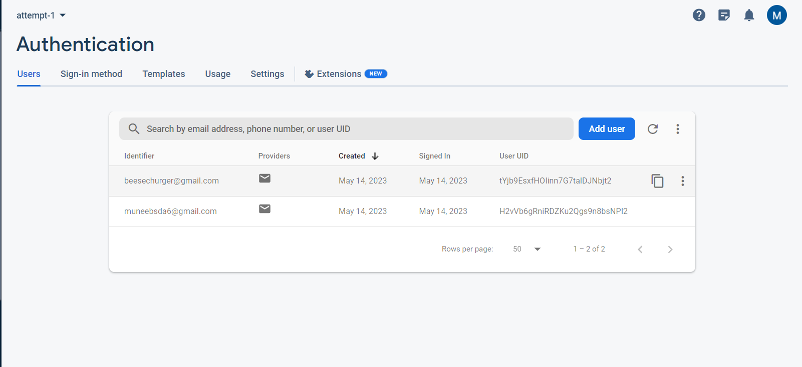
Their profile pictures are stored by Firebase Storage:
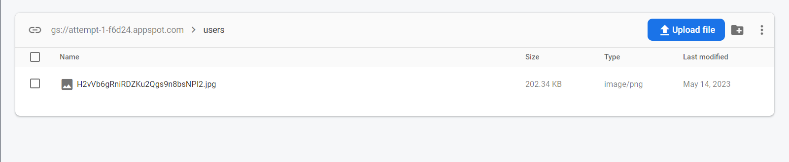
Opening the app leads to the login screen if not logged in, and the last tab (retrieved from **SharedPrefs**)
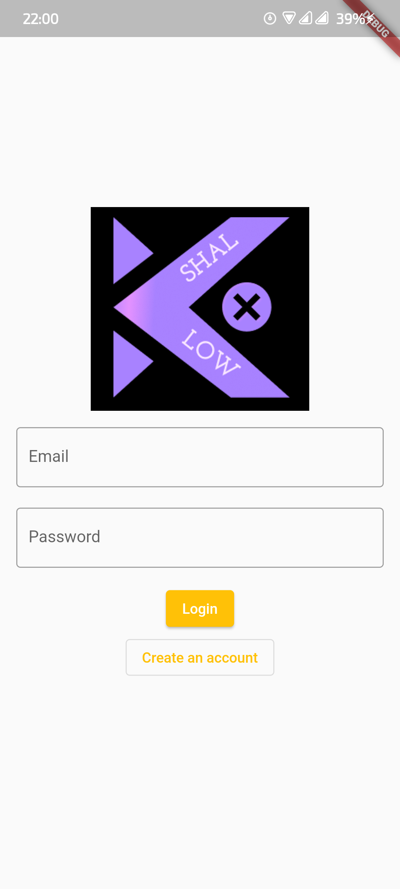
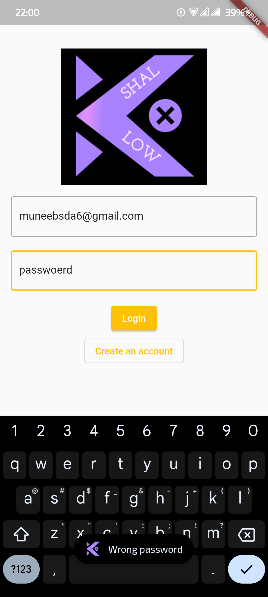
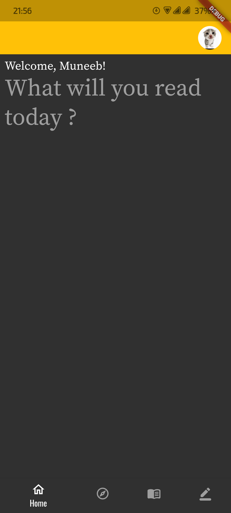

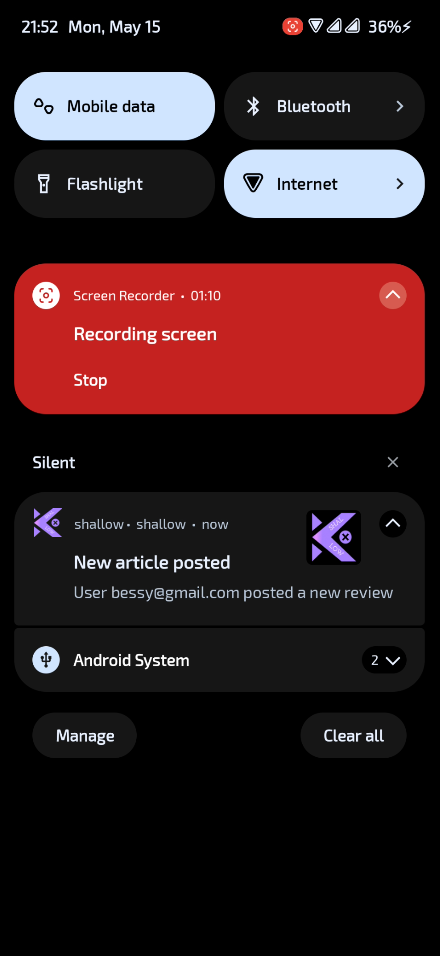
The user profile image is stored on Firebase storage, and is freely changeable through File Picker.

## Books
Books can be downloaded and viewed in the app, with persistent progress. Currently the book database is generated from gutendex. This can be further extended by using a vendor database for example. Think the Kobo Reader app.
For the reader part, I used Vocsy epub viewer package.
Books are separated by genres first
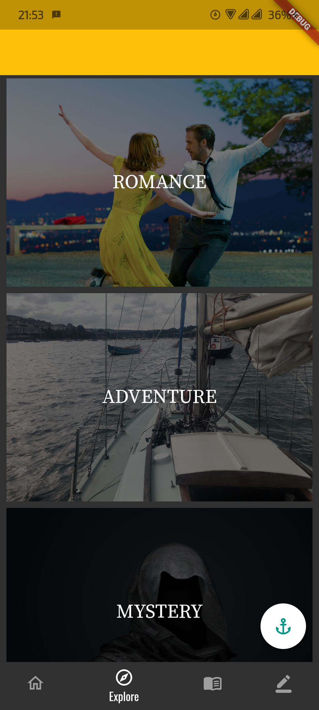
Then in each genre:
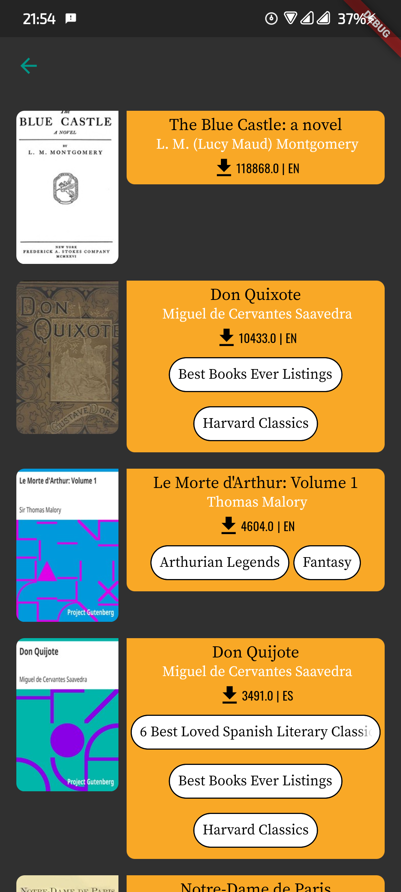
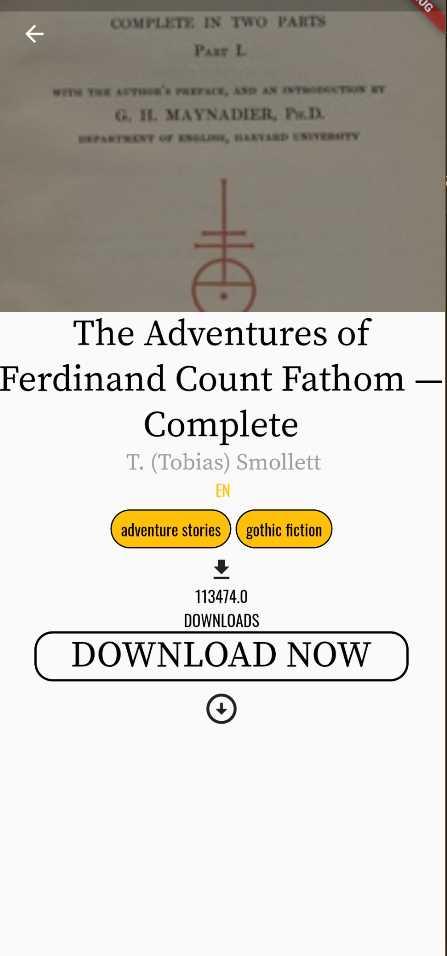
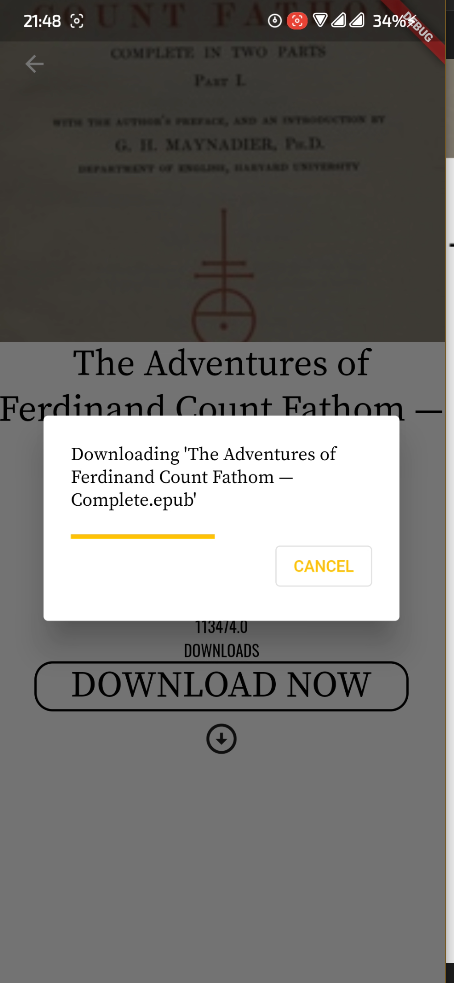
Once downloaded, the book ends up in my books
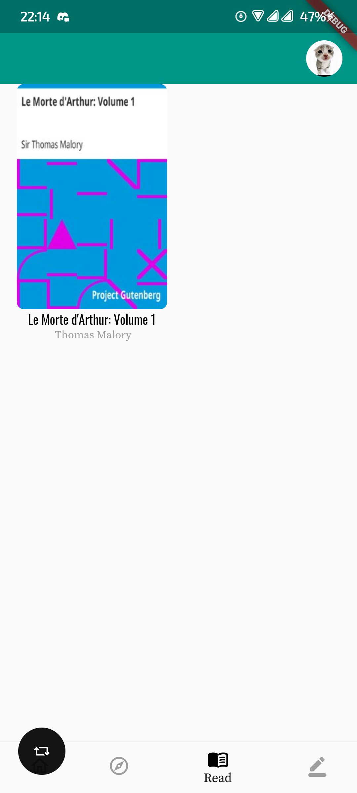

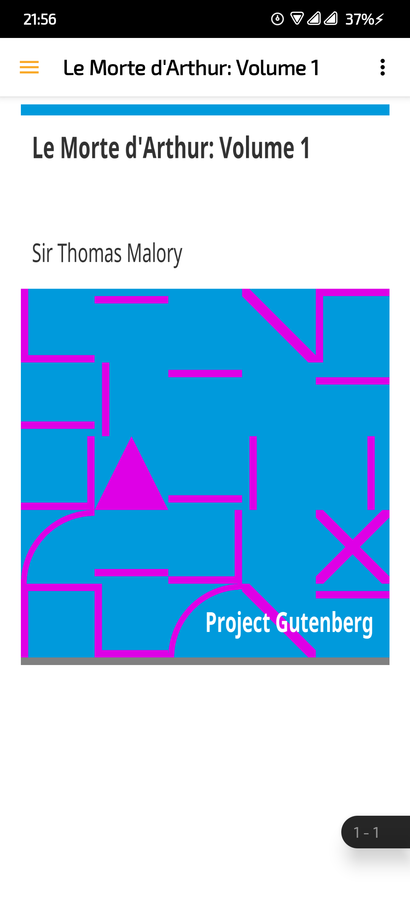
Webview for gutendex, to read directly.

## Articles
Associated with a user, articles can be reviews, editorial pieces, hype pieces, special announcements or stories.
Articles are stored on Firestore.
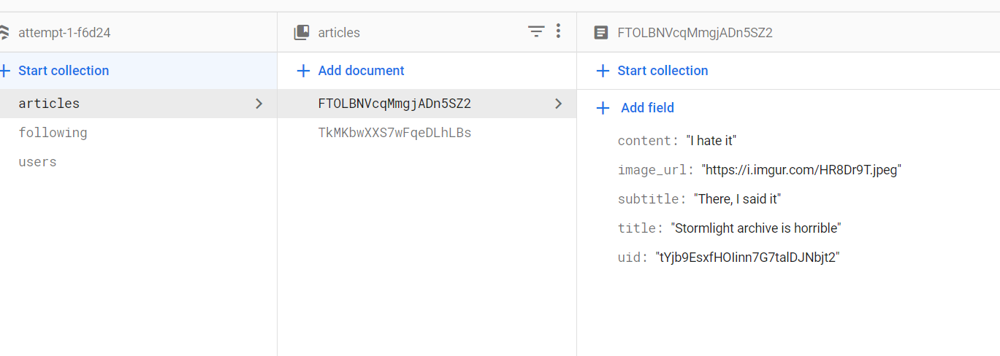

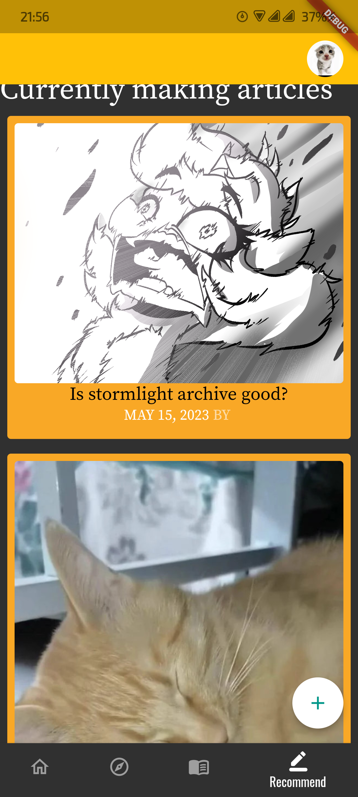
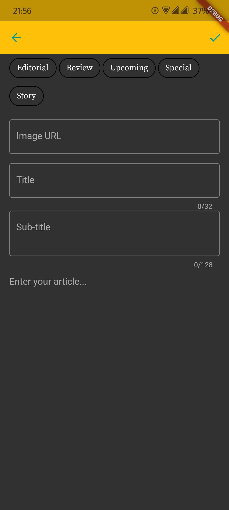